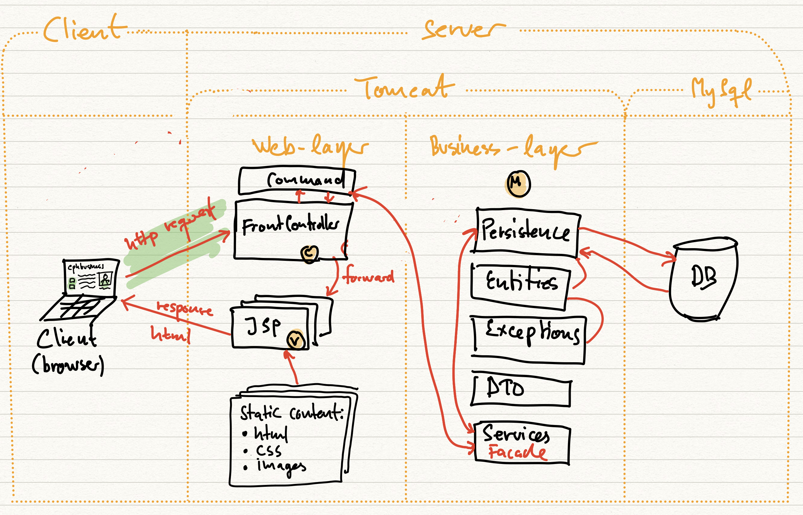

INTRODUKTION TIL PROJEKTET

Dette er et eksamensprojekt til afslutning af 2. semester af datamatiker uddannelsen på cph-business. Formålet med
projektet er at udvikle et bookingSystem til udlejning af skolens materialer. I documentation-mappen vil i finde diverse
screenshots. Blandt andet et EER Diagram der viser første udkast af databasens struktur, samt først udsnit til et
KanBan board der havde til hensigt at danne overblik for min arbejdsgang.

LOGBOG

25/07-2022
Første dag blev brugt til at få de grundliggende beslutninger på plads. Jeg fik oprettet en mysql database, et
remote repository på git@github.com:Mollerten/bookingSystem.git, samt første udsnit til et KanBan board som desuden
også er linket til projektet via github.

26/07-2022
Første udkast til projektets struktur er på plads med klasse som createUser, viewBookings og viewEquipment 80%
færdige.

27/07-2022
En uventet fejl 500 har gjort at jeg ikke er i stand til at logge ind på sitet og derved har svært ved at overskue
websitets struktur. Jeg oplever også store udfordringer med at teste mine metoder og jsp-siders opbygning.
Jeg søger rådgivning hos både underviser og fælles studerende i håbet om at blive klogere.

01/08-2022
Underviser kommer til undsætning! Fejlen er løst og udviklingen forsætter. Projektets hovedfunktioner er på plads
med enkelte hardcodet punkter grundet tidspres som følger af den tidligere fejl 500. En admin er nu i stand til at
se samtlige brugere i databasen, oprette nye brugere, se alle bookinger. Desuden kan både almindelige brugere og
admin se udstyr der er tilgængeligt til udlejning, samt leje dette.

    Endnu en uventet fejl er dukket op, denne gang på github. Mit KanBan board er fastlåst, jeg er ude af stand til at
    flytte mine issues fra den ene box til den anden.

02/08-2022
De sidste forberedelser til aflevering er ved at komme på plads. Jeg mangler desværre nogle mindre funktionaliteter
såsom at fjerne bookingPoints per dag et materiale er udlånt, men i forhold til arbejdsbyrden ville dette ikke tage
mere end én time at få i luften.

## MVC arkitektur med front-controller

